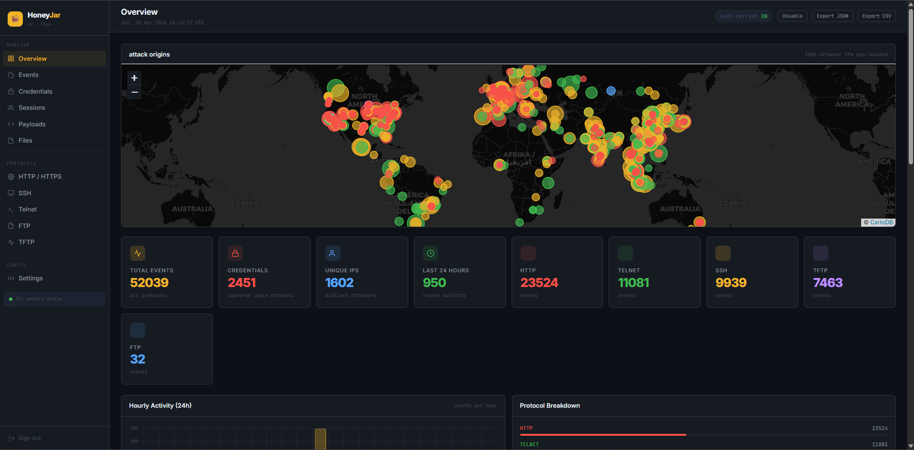

# HoneyJar v2



Honeypot lab that runs in Docker. SSH, Telnet, HTTP/HTTPS, FTP, and TFTP all listening at once — everything gets logged into Postgres and shows up in a live dashboard. One command to start, no config files to touch, no database setup. The script writes everything itself and spins up the containers.

Every protocol supports multiple ports at the same time. SSH on 22 and 2222, FTP on 21 and 2121, TFTP on 69 and 6969 — just edit one JSON file and the honeypots pick it up without rebuilding.

---

## What it logs

**SSH / Telnet** — powered by Cowrie. Logs every login attempt with the username and password. If an attacker gets a shell, every command gets captured too. Nothing actually runs on the host — Cowrie gives them a fake environment and fake output.

**HTTP / HTTPS** — logs the full request: method, path, headers, body, user agent. Serves fake pages that look like real targets (WordPress login, phpMyAdmin, .env files, admin panels). Scanners hit them and start throwing credentials, all of which end up in the database.

**FTP** — takes any login, shows a fake filesystem full of stuff that looks worth grabbing (db_backup_2024.sql.gz, credentials.txt, SSH keys). Every command, download, and upload gets logged. The files are bait for automated tools that just try to pull everything.

**TFTP** — serves fake router configs and firmware images on read requests, captures whatever gets pushed on write requests. A lot of scanning scripts specifically look for TFTP to grab Cisco configs, so it gives them something to find.

---

## Setup

Needs Docker with the compose plugin and Python 3.8+. Root is required if you want the iptables IP blocking to work.

```bash
git clone https://github.com/nick-pyc/HoneyJar-V2
cd HoneyJar-V2
python3 HoneyJarV2.py
```

Dashboard runs at `http://localhost:5000`. Access key and owner key both print to the terminal on first start. Change `ACCESS_KEY` and `OWNER_KEY` in `HoneyJarV2.py` before running this on anything public.

---

## Ports

| Service   | Default  | Protocol |
|-----------|----------|----------|
| SSH       | 22       | TCP      |
| Telnet    | 23, 2323 | TCP      |
| HTTP      | 80, 8080 | TCP      |
| HTTPS     | 443      | TLS      |
| FTP       | 21       | TCP      |
| TFTP      | 69       | UDP      |
| Dashboard | 5000     | TCP      |

To add or change ports, edit `cowrie/etc/ports_config.json` — changes take effect without rebuilding. Or set `DEFAULT_PORTS` in `HoneyJarV2.py` before the first run:

```json
{
  "ssh":    [22, 2222],
  "telnet": [23, 2323],
  "http":   [80, 8080],
  "https":  [443],
  "ftp":    [21, 2121],
  "tftp":   [69, 6969]
}
```

HTTP picks up port changes in about 5 seconds without restarting. SSH and Telnet do a Cowrie container restart to apply them.

---

## Dashboard

**Overview** — live attack map, hourly activity graph, top attacker IPs, top credential combos, recent events

**Events** — full paginated log with filters for protocol, event type, IP, and date range. Export as JSON, CSV, or TXT.

**Credentials** — every username/password pair from every protocol in one place. Filterable, and exportable as a wordlist if you want to feed it somewhere.

**Sessions** — attackers grouped by IP and protocol. Click a row to see everything that IP did, in order, with timestamps.

**Payloads** — commands run over SSH/Telnet, FTP/TFTP file transfers, HTTP POST bodies. Has a hex viewer built in.

**Protocol pages** — SSH, Telnet, HTTP, FTP, and TFTP each have their own page with stats and a filtered event table.

**Settings** — change ports, manage blocked IPs, export data. Requires the owner key.

Every IP, credential, and command on every page has a copy button.

### Keys

Two separate keys — an access key to get into the dashboard, and an owner key to get into Settings. The owner key is asked separately even if you're already logged in. Both are in `HoneyJarV2.py` and passed to the container as env vars, never written to the database.

---

## IP blocking

Block an IP from the dashboard and it gets written to `blocked_ips.txt`. A bash watcher script syncs that file to an iptables chain (`HONEYJAR2`) every few seconds, so blocked IPs get dropped at the kernel level almost instantly. Needs root to work — if you're running without it, the watcher just skips and everything else is fine.

---

## Layout

```
HoneyJar-V2/
├── HoneyJarV2.py
├── cowrie/
│   └── etc/
│       ├── cowrie.cfg
│       ├── userdb.txt
│       ├── ports_config.json    ← edit to change ports at runtime
│       └── blocked_ips.txt      ← written by dashboard, read by block watcher
├── dashboard/
│   ├── app.py
│   ├── Dockerfile
│   ├── static/
│   │   ├── favicon.svg
│   │   └── preview.png
│   └── templates/
├── http_honeypot/
├── ftp_honeypot/
├── tftp_honeypot/
└── cowrie_watcher/
```

---

## Notes

Don't put port 5000 on the internet. The honeypot ports are supposed to be exposed, that's the whole point — but the dashboard should stay behind a VPN or firewall.

The FTP filesystem is built to look like a server someone left wide open. `credentials.txt`, `id_rsa`, SQL dumps — automated tools will try to pull all of it, which is exactly what you want.

Cowrie's fake shell is convincing. Most attackers will run their whole playbook — `uname`, `whoami`, `cat /etc/passwd`, download scripts — and never figure out they're sandboxed.

Geo IP uses ip-api.com's free batch endpoint (45 req/min). No API key needed. Under heavy load there'll be a short delay before new IPs appear on the map.

To wipe everything and start clean: `docker compose down -v` removes the containers and the Postgres volume.
